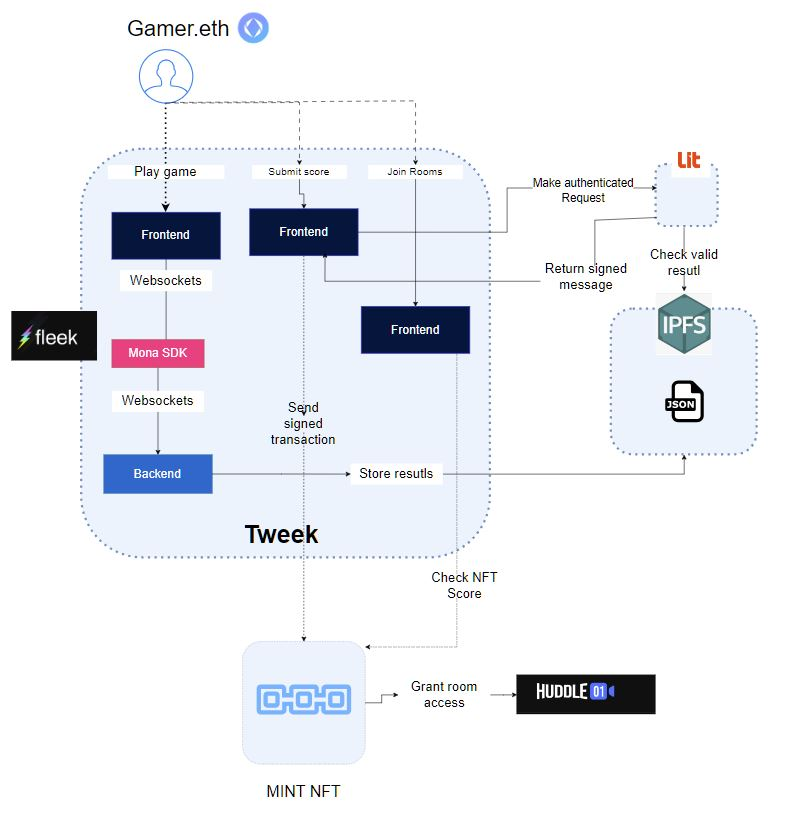

# MintScore

Project created in ETHGlobal Hackfs2024

## Table of Contents

- [MintScore](#mintscore)
  - [Table of Contents](#table-of-contents)
  - [Description](#description)
  - [How is made](#how-is-made)
  - [Components](#components)

## Description

We have developed a functionality that allows any game developed in Unity to use Mona SDK to publish and mint their in game data scores on chain. This allows gamers to mint achievements on their games and use them to access specific competitions based on their gaming expertise. With this NFT the gamer is able not just to prove their achievements but also to access token gated events like private chat rooms in Huddle

## How is made

We have integrated the Mona SDK to enable users to connect their wallets to existing Unity games and send actions related to their wallets. When a gamer ends playing and a score is generated this is automatically sent to IPPFS using WebSockets relating their score to the wallet that the user logs in the game.

The user then can mint a Score NFT, to do so, the user sends a request with the score to mint, and our app sends a request to the LIT protocol nodes using a lit action that checks that this score exists associated with this wallet, and if so, signs a message to verify that this is correct. Then the user can send this signed message to the contracts to check that the signed wallet is correct and generate an NFT with this score.

This NFT score can be used as "Score token gating" to access different chat rooms or events using the token gating functionality on Huddle

## Components

The repository consists on three different components:

- Backend: Node js repository that expose a websocket server to listen the events and store the scores on IPFS related to the wallet id. Also has an express API to let LIT protocol to call this endpoint and find all the existing files with the corresponding scores and verify that the user that send the request have actually record this score.
- Dapp: contains itself two components:
  - Hardhat: Smart contracts to verify the signed message by lit and mint the corresponding score NFT.
  - nextjs: Frontend where the user can play the game, mint their NFTS and joins to token gating rooms in huddle.
- Game: An existing open source Unity game that can be found here: https://github.com/EugenyN/AmazingTrack where we added the Monaverse SDK to give it web3 capabilities and allow the users to connect their wallets.
